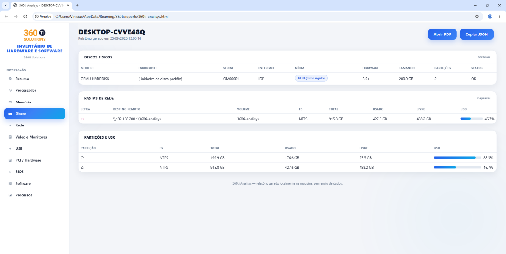

# 360ti HWiNFO

Levantamento de hardware e software do Windows em segundos. Coleta localmente os dados da máquina (processador, placa-mãe, memória, discos, rede, BIOS, software, etc.) e gera um **relatório HTML navegável** (menu lateral, estilo SaaS), um **PDF legível** e um **JSON** com tudo estruturado — sem enviar nada para servidores. Personalizável por `config.json` (logo em base64 e cores) e distribuível por instalador NSIS.

## Pré-visualização



## Como funciona

1. Executa o coletor (`360ti-hwinfo.exe`, sem console).
2. Lê o `config.json` (logo + cores) do lado do executável para personalizar o relatório.
3. Coleta dados via WMI (`github.com/StackExchange/wmi`), CPUID (`klauspost/cpuid/v2`) e gopsutil.
4. Gera:
   - `reports/360ti-hwinfo.html` — relatório navegável com menu lateral (estilo HWiNFO), botões **Abrir PDF** e **Copiar JSON**.
   - `reports/360ti-hwinfo.pdf` — documento A4 com todas as seções em tabelas.
   - `reports/360ti-hwinfo.json` — dados estruturados (também embutidos no HTML para o botão Copiar JSON).
5. Abre o HTML no navegador padrão.

A pasta `reports` fica em **user data** (`%AppData%\360ti\reports` no Windows), sempre gravável mesmo com o app instalado em `Program Files`.

## O que é coletado

- Resumo: hostname, SO, kernel, uptime, reboot, máquina
- Processador: detalhes CPUID (cache L1/L2/L3, microarquitetura, conjunto de instruções), processadores por pacote
- Sensores de temperatura (ACPI)
- Placa-mãe, produto (serial/UUID) e gabinete (tipo de chassi)
- Memória: total/uso + módulos (slot, capacidade, velocidade, tipo)
- Discos físicos (modelo, serial, interface, mídia SSD/HDD/NVMe, firmware) e partições/uso
- Pastas de rede mapeadas (destino remoto UNC)
- Placas de rede (IP, máscara, gateway, DHCP, DNS, velocidade do link)
- Placas de vídeo e monitores
- Controladores USB
- Dispositivos PCI/PCIe e possíveis componentes de chipset
- BIOS/UEFI (modo de boot, especificação SMBIOS, versão)
- Software instalado (do registro)
- Processos (top por memória)

## Uso

Dê duplo clique no `360ti-hwinfo.exe` ou rode no **CMD** / **PowerShell**:

```text
360ti-hwinfo.exe                 # coleta e abre o HTML no navegador
360ti-hwinfo.exe -out CAMINHO    # gera o relatório em CAMINHO (html + pdf)
360ti-hwinfo.exe -open=false     # gera sem abrir o navegador
360ti-hwinfo.exe -report DIR     # gera report.html/.pdf/.json/.dat em DIR sem abrir
360ti-hwinfo.exe -timing         # grava log de tempo (diagnóstico)
```

## Configuração (`config.json`)

O coletor lê `config.json` do lado do executável. O logo é embutido como base64 no HTML.

```json
{
  "app_name": "360ti HWiNFO",
  "company_name": "360ti",
  "logo": "logo360ti.png",
  "logo_base64": "",
  "colors": {
    "accent": "#2563eb",
    "accent2": "#3b82f6",
    "accent3": "#0ea5e9",
    "accent4": "#60a5fa",
    "background": "#f3f5f9",
    "sidebar": "#ffffff",
    "surface": "#ffffff",
    "surface2": "#f1f5f9",
    "border": "#e5e9f0",
    "text": "#0f172a",
    "muted": "#64748b"
  }
}
```

- `logo`: caminho do arquivo de logo (relativo ao exe). Também pode usar `logo_base64` com o base64 (ou data URI) do logo.
- `colors`: sobrescreve o tema (independente de config.json, os valores padrão são os acima).

## Requisitos

**Para usar o programa (máquina final):**
- Windows 10/11 (64 ou 32 bits)
- Apenas o executável: `360ti-hwinfo.exe` + `config.json` (opcional) + `logo360ti.png` (opcional). Nenhuma dependência — WMI, CPUID e o relatório são tudo nativo.

**Para compilar o binário:**
- [Go](https://go.dev/dl) 1.20 ou superior
- Git (opcional, para clonar)

**Para gerar o instalador (.exe NSIS):**
- [NSIS](https://nsis.sourceforge.io) 3.x (com `makensis`)

**Para editar o relatório (logo/cores):**
- Editor de texto simples (o `config.json` fica ao lado do executável)

## Como pegar o código (Git)

No **PowerShell** ou no **CMD (Prompt de Comando)** do Windows:

```bash
# HTTPS
git clone https://github.com/vmsouza/360ti-hwinfo.git
cd 360ti-hwinfo

# ou via SSH (precisa da chave configurada no GitHub)
git clone git@github.com:vmsouza/360ti-hwinfo.git
cd 360ti-hwinfo
```

## Como instalar o ambiente no Windows (sem Go/NSIS instalados)

Instale via **winget** ([PowerShell](https://learn.microsoft.com/en-us/powershell/scripting/windows-powershell/install/installing-windows-powershell) — abra o terminal como administrador) ou pelos sites oficiais:

```powershell
# PowerSHell (winget)
winget install GoLang.Go
winget install NSIS.NSIS
winget install Git.Git
```

No **CMD (Prompt de Comando)**, o winget também funciona:

```cmd
winget install GoLang.Go
winget install NSIS.NSIS
winget install Git.Git
```

Ou baixe manualmente:
- Go: https://go.dev/dl (instalador MSI) — após instalar, **feche e reabra o terminal** para o `go` entrar no PATH.
- NSIS: https://nsis.sourceforge.io/Download
- Git: https://git-scm.com/downloads

Depois, verifique se o Go está no PATH — no **PowerShell** ou **CMD**:

```bash
go version
```

Para **usar** o programa, não é preciso instalar nada: copie o `360ti-hwinfo.exe` (e o `config.json` + `logo360ti.png`, se quiser personalizar) para qualquer pasta e execute.

## Build

Requer Go 1.20+.

**No Linux (bash):**

```bash
# build.sh compila para Windows (amd64 e 386) e gera dist/360ti-hwinfo.exe
./build.sh

# ou manualmente
GOOS=windows GOARCH=amd64 go build -ldflags "-s -w -H windowsgui" -o dist/360ti-hwinfo.exe .

# build de teste local (Linux)
go build -o tmp/360ti-hwinfo .
```

**No Windows — PowerShell:**

```powershell
$env:GOOS="windows"; $env:GOARCH="amd64"
go build -ldflags "-s -w -H windowsgui" -o dist\360ti-hwinfo.exe .
$env:GOOS=""; $env:GOARCH=""   # volta ao normal
```

**No Windows — CMD (Prompt de Comando):**

```cmd
set GOOS=windows&& set GOARCH=amd64&& go build -ldflags "-s -w -H windowsgui" -o dist\360ti-hwinfo.exe .
set GOOS=&& set GOARCH=
```

```bash
# build.sh compila para Windows (amd64 e 386) e gera dist/360ti-hwinfo.exe
./build.sh

# ou manualmente
GOOS=windows GOARCH=amd64 go build -ldflags "-s -w -H windowsgui" -o dist/360ti-hwinfo.exe .

# build de teste local (Linux)
go build -o tmp/360ti-hwinfo .
```

## Instalador (NSIS)

Em `installer/360ti-hwinfo.nsi`. No Windows, com NSIS 3.x, rode na pasta do projeto (onde `installer\` e `dist\` são irmãs) — no **CMD (Prompt de Comando)** ou **PowerShell**:

```cmd
makensis installer\360ti-hwinfo.nsi
```

```powershell
makensis installer\360ti-hwinfo.nsi
```

Gera `360ti-hwinfo-setup.exe` (atalhos, desinstalador, Add/Remove Programs). O script espera `dist\` com os arquivos ao lado de `installer\`.

## Estrutura

```text
.
├── main.go              # entrada: flags e fluxo (coleta -> HTML/PDF/JSON)
├── collect.go           # coleta cross-platform (host, cpu, memória, discos, rede, processos)
├── collect_windows.go   # coleta Windows: WMI, sensores, PCI, pasta de rede, etc.
├── collect_other.go     # stub não-Windows
├── network_windows.go   # discos físicos e placas de rede detalhadas (WMI)
├── cpuid.go             # detalhes do processador via CPUID
├── config.go            # lê config.json: logo (base64) + cores
├── dataset.go           # seções compartilhadas (report.dat e PDF)
├── pdf.go               # gerador de PDF (fonte DejaVu embarcada)
├── reportfiles.go       # grava HTML/JSON/DAT/PDF
├── report.go            # template HTML (Bootstrap embarcado) + JSON embutido
├── timing.go            # diagnóstico de tempo (opcional)
├── assets.go            # bootstrap css/js embarcados
├── browser_windows.go   # abrir navegador / caixa de erro (Windows)
├── browser_other.go     # stub não-Windows
├── fonts/               # fontes TTF embarcadas no PDF
├── static/              # bootstrap.min.css / bootstrap.bundle.min.js
├── config.json          # logo + cores (lido ao lado do exe)
├── logo360ti.png        # logo padrão
├── dist/                # binários gerados + config/logo de distribuição
├── installer/           # NSIS + setup gerado
│   ├── 360ti-hwinfo.nsi
├── tela.png             # screenshot do relatório
└── build.sh
```

## Plataforma

Foco em **Windows** (amd64 e 386). A GUI principal é o relatório HTML/PDF; coleta via WMI/CPUID só no Windows.